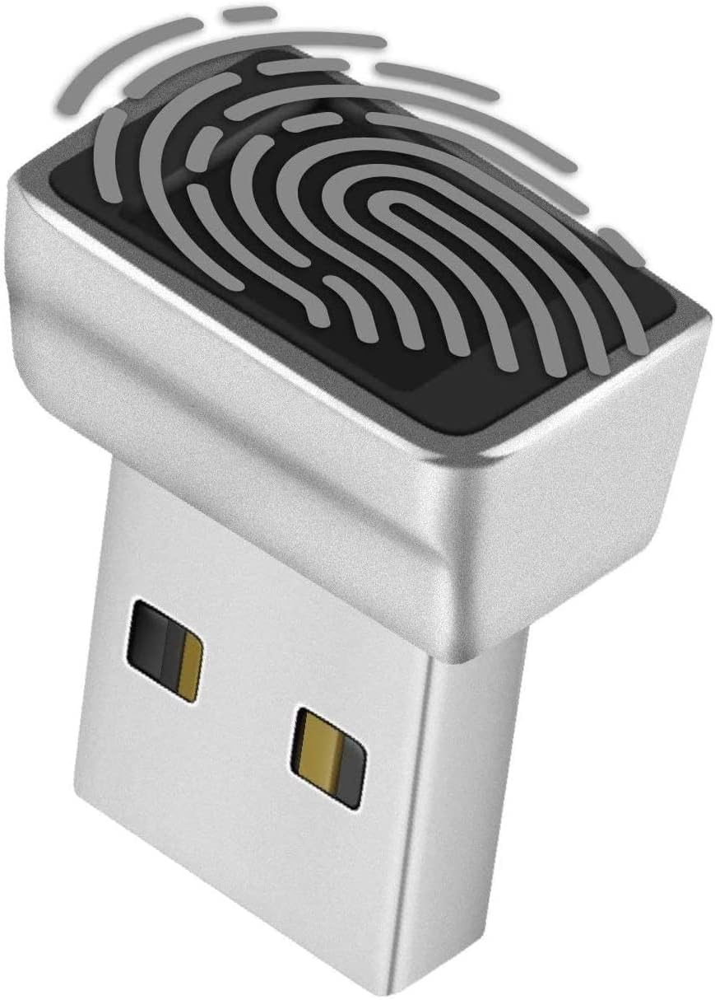

# MAFP Fingerprint Driver (USB 3274:8012)

**[中文](README_zh.md)** | English

An open-source libfprint driver for the **MicroarrayTechnology MAFP** fingerprint reader (USB `3274:8012`), enabling fingerprint enrollment and verification on Linux through `fprintd` and PAM.

The driver was reverse-engineered from the Windows WBDI driver (`MicroarrayFingerprintDevice.dll` v9.47.11.214) using Ghidra 12.0.4. It is a fully independent implementation — no vendor binaries or proprietary code are included.

## Features

- **Fingerprint enrollment** — 6-stage press/lift capture flow
- **Fingerprint verification** — 1:1 template matching against stored FID slots
- **Desktop login** — GNOME / KDE PAM authentication and `sudo` support
- **On-device storage** — stores up to 30 fingerprint templates in device flash
- **Finger detection** — polls sensor for finger presence during enrollment

## Supported Hardware

<p align="center"></p>

| | |
|---|---|
| **USB ID** | `3274:8012` |
| **Device name** | MicroarrayTechnology MAFP General Device |
| **Form factor** | USB-A nano adapter |

Verified with: **TNP Nano USB Fingerprint Reader** ([Amazon B07DW62XS7](https://www.amazon.com/dp/B07DW62XS7))

> **Check your device:**
> ```bash
> lsusb | grep 3274:8012
> ```

## How It Works

This project patches the upstream [libfprint](https://gitlab.freedesktop.org/libfprint/libfprint) (v1.94.x) source tree to add the microarray driver, then you build and install the resulting `libfprint-2.so` library. The modified library is a drop-in replacement for your distro's package.

**Authentication chain:**
```
GNOME / sudo / polkit  ->  PAM (pam_fprintd)  ->  fprintd  ->  libfprint  ->  USB device
```

---

## Quick Start

### 1. Install build dependencies

<details>
<summary>Fedora</summary>

```bash
sudo dnf install -y rpmdevtools meson ninja-build gcc git cpio
sudo dnf builddep -y libfprint
```
</details>

<details>
<summary>Debian / Ubuntu</summary>

```bash
sudo apt update
sudo apt install -y devscripts dpkg-dev meson ninja-build git
sudo apt build-dep -y libfprint
```

> **Note:** If `apt build-dep` fails with version conflicts, you may need to enable `deb-src` repositories. On Ubuntu, edit `/etc/apt/sources.list.d/ubuntu.sources` and ensure `Types: deb deb-src`.
</details>

### 2. Get libfprint source

<details>
<summary>Fedora (RPM source)</summary>

```bash
sudo dnf download --source libfprint
rpm -ivh libfprint-*.src.rpm

mkdir -p /tmp/libfprint-src
cd /tmp/libfprint-src
rpm2cpio ~/rpmbuild/SRPMS/libfprint-*.src.rpm | cpio -idmv

tar -xf libfprint-v*.tar.gz
cd libfprint-v*/
```
</details>

<details>
<summary>Debian / Ubuntu</summary>

```bash
apt source libfprint
cd libfprint-*/
```
</details>

### 3. Apply patch and build

```bash
patch -p1 < /path/to/mafp-fingerprint-driver/patches/0001-libfprint-add-microarray-3274-8012-driver.patch

meson setup build-microarray -Ddoc=false -Dgtk-examples=false -Dintrospection=false
meson compile -C build-microarray
```

Output: `build-microarray/libfprint/libfprint-2.so.2.0.0`

### 4. Install and verify

#### Fedora

```bash
# Backup original
sudo cp /usr/lib64/libfprint-2.so.2.0.0 /usr/lib64/libfprint-2.so.2.0.0.orig

# Install new build
sudo install -m 0755 build-microarray/libfprint/libfprint-2.so.2.0.0 /usr/lib64/libfprint-2.so.2.0.0

# IMPORTANT: move backup OUT of system library path
sudo mkdir -p /opt/libfprint-backup
sudo mv /usr/lib64/libfprint-2.so.2.0.0.orig /opt/libfprint-backup/

sudo ldconfig
sudo systemctl restart fprintd

# Verify
fprintd-list $USER
```

#### Debian / Ubuntu

```bash
sudo cp /usr/lib/x86_64-linux-gnu/libfprint-2.so.2.0.0 /usr/lib/x86_64-linux-gnu/libfprint-2.so.2.0.0.orig
sudo install -m 0755 build-microarray/libfprint/libfprint-2.so.2.0.0 /usr/lib/x86_64-linux-gnu/libfprint-2.so.2.0.0
sudo mkdir -p /opt/libfprint-backup
sudo mv /usr/lib/x86_64-linux-gnu/libfprint-2.so.2.0.0.orig /opt/libfprint-backup/
sudo ldconfig
sudo systemctl restart fprintd
fprintd-list $USER
```

Expected output:
```
found 1 devices
Device at /net/reactivated/Fprint/Device/0
Using device /net/reactivated/Fprint/Device/0
User <username> has no fingers enrolled for MicroarrayTechnology MAFP.
```

### 5. Enroll a fingerprint

```bash
fprintd-enroll $USER
# Place your finger on the sensor 6 times
```

### 6. Test verification

```bash
fprintd-verify $USER
# Place an enrolled finger
```

---

## Library Install Paths

| Distro | Library path |
|---|---|
| Fedora | `/usr/lib64/libfprint-2.so.2.0.0` |
| Debian / Ubuntu | `/usr/lib/x86_64-linux-gnu/libfprint-2.so.2.0.0` |

---

## Automate with Script (Fedora)

A one-shot build script is provided for Fedora:

```bash
./scripts/build-fedora-local.sh /path/to/libfprint-source
```

---

## Troubleshooting

### `No driver found for USB device 3274:8012`

The most common cause is `fprintd` loading a stale backup library instead of your new build.

```bash
pid=$(pgrep -n fprintd)
grep libfprint /proc/$pid/maps | head
```

If you see `.bak` or `.orig` files being loaded, move them out of the system library directory:

#### Fedora

```bash
sudo mv /usr/lib64/libfprint-2.so.2.0.0.bak /opt/libfprint-backup/
sudo ldconfig
sudo systemctl restart fprintd
```

#### Debian / Ubuntu

```bash
sudo mv /usr/lib/x86_64-linux-gnu/libfprint-2.so.2.0.0.bak /opt/libfprint-backup/
sudo ldconfig
sudo systemctl restart fprintd
```

### `No devices available`

```bash
# Confirm device is connected
lsusb | grep 3274:8012

# Check service status
systemctl --no-pager --full status fprintd

# Check logs
journalctl -u fprintd -n 120 --no-pager
```

### `Patch fails to apply`

The included patch was generated against libfprint **v1.94.10**. If your distro ships a different version, apply the changes manually:

1. **`meson.build`** — add `'microarray'` to `default_drivers` and `endian_independent_drivers` lists
2. **`libfprint/meson.build`** — add driver source mapping:
   ```meson
   'microarray' :
       [ 'drivers/microarray/microarray.c' ],
   ```
3. **`libfprint/drivers/microarray/microarray.c`** — copy from `src/microarray.c` in this repo

### Health check after any change

#### Fedora

```bash
# Device visibility
fprintd-list $USER

# Service status
systemctl --no-pager --full status fprintd

# Loaded library (must NOT be .bak)
pid=$(pgrep -n fprintd)
grep libfprint /proc/$pid/maps | head

# Build-id
readelf -n /usr/lib64/libfprint-2.so.2.0.0 | sed -n '/Build ID/,+1p'
```

#### Debian / Ubuntu

```bash
fprintd-list $USER
systemctl --no-pager --full status fprintd
pid=$(pgrep -n fprintd)
grep libfprint /proc/$pid/maps | head
readelf -n /usr/lib/x86_64-linux-gnu/libfprint-2.so.2.0.0 | sed -n '/Build ID/,+1p'
```

---

## Project Structure

```
mafp-fingerprint-driver/
├── src/
│   └── microarray.c
├── patches/
│   └── 0001-libfprint-add-microarray-3274-8012-driver.patch
├── scripts/
│   └── build-fedora-local.sh
├── docs/
│   ├── FINGERPRINT_MAFP_DEV_MANUAL.md
│   └── upstream/
│       ├── CHANGELOG.upstream.md
│       ├── README.upstream.md
│       ├── fingerprint-driver-re.md
│       ├── fingerprint-reader-setup.md
│       └── reverse-engineering.md
├── LICENSE
└── README.md
```

## License

This project is released under the [MIT License](LICENSE).
